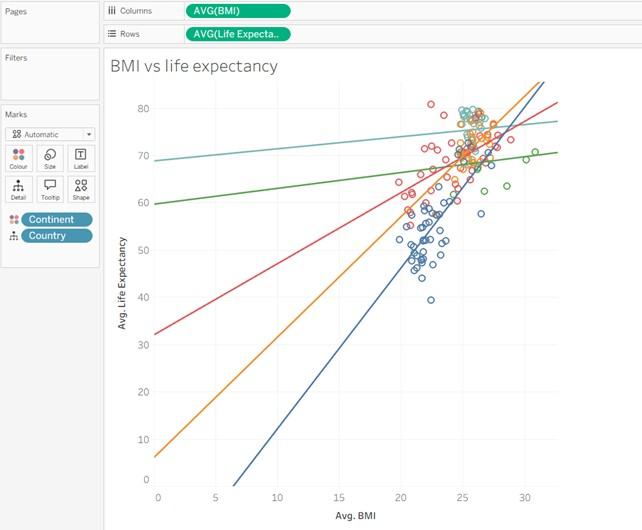
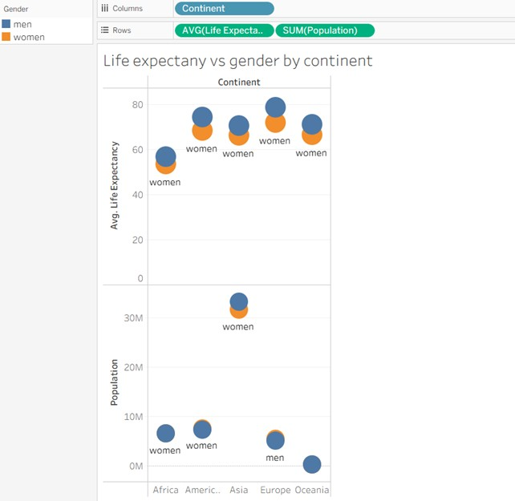
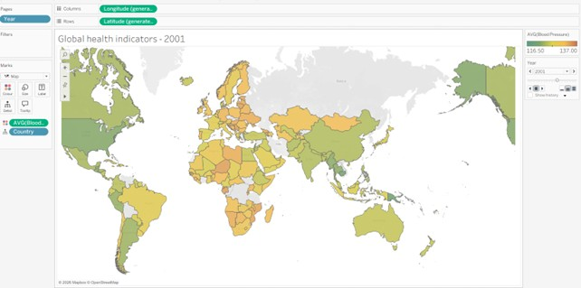

# Tableau
Using global health data downloaded in Excel, provide various health comparison visualisations of this data by different categories in Tableau.

The health data represents the various health biometrics for most countries around the world, covering issues such as cancer rates, life expectancies, blood pressure rates, population growth, etc, all tracked every year from 1990 through to 2008.

[Source Health Data](https://github.com/samborro/Tableau/blob/main/GapminderHealth(in).csv)

## Analysis

Using the Source Health Data, I produced some graphics in Tableau that showed the following:
1. Average life expectancy vs gender by continent
2. Average BMI vs Average life expectancy
3. Average blood pressure by country

### Results

   

For each category, the visualistions of this data shows you at a glance the visual representation of what each analysis represents in terms of comparisons instead of having to trawl through hundreds or thousands of lines of raw data. 
1. [Average life expectancy vs gender by continent](https://github.com/samborro/Tableau/blob/main/life%20expectancy%20vs%20gender%20by%20continent.jpg)
   
For average life expectancy vs gender by continent, we can see that for most continents (Asia was an exception, but not by much), the populations of males to females is virtually identical, yet, on all continents, men on average live longer than women. The NHS could use this to focus more resources into certain medical issues that seem to affect women more than men (or only would affect women) to help overcome this disparity.
2. [Average BMI vs Average life expectancy](https://github.com/samborro/Tableau/blob/main/BMI%20vs%20life%20expectancy.jpg)
   
For BMI vs life expectancy, we can see that poorer countries generally have lower life expectancies and low BMI. This is likely due to low wealth means lack of access to suitable food, and suitable healthcare, meaning people are dying younger, possibly from easily preventable diseases, due to being malnourished.
Its interesting, that countries with high BMI , ie overweight, still have relatively high life expectancies. This suggests that being malnourished has a much larger adverse effect on your life expectancy than overeating. Whilst being overweight has its own effects on ill health, being underweight has a much larger adverse effect.
3. [Average blood pressure by country](https://github.com/samborro/Tableau/blob/main/average%20blood%20pressure%20by%20country.jpg)
   
For average blood pressure by country, we can see that blood pressure levels are generally high in Europe and Africa, with low blood pressure levels prevalent in the Americas and Asia.
This could be a result of poor diets, with high blood pressure in Africa due to poverty leading to lack of healthy foods, and Europe, due to wealth, eating too much meat and junk food. Though North America does seem to buck this trend with very low blood pressure values on average. This does make me wonder to the accuracy of this data.

